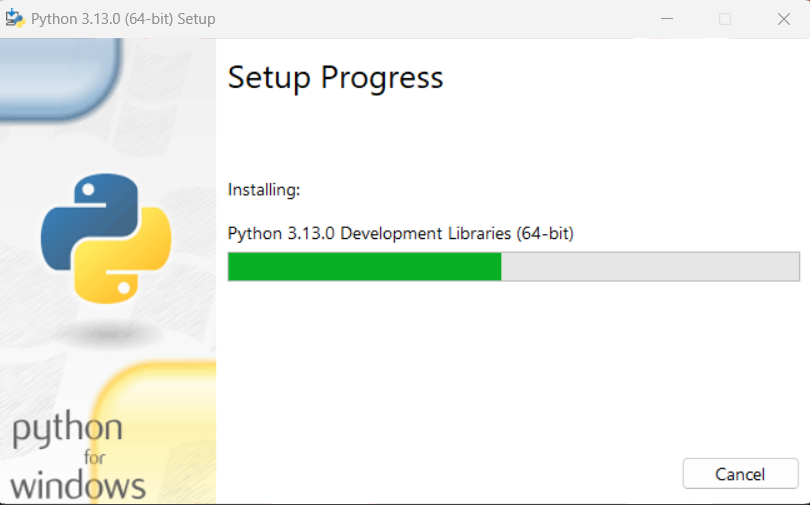

INSTITUTO TECNOLÓGICO SUPERIOR DE CHICONTEPEC

MARISOL HERNÁNDEZ MARTÍNEZ 

# MANUAL DE DESCARGA E INSTALACIÓN DE PYTHON
## Descaga de Python
 
1. Para la descarga del lenguaje de programación Python accedemos al navegador web y
escribimos el término “Python”, una vez que se muestran los resultados de la búsqueda
seleccionamos la segunda opción que se muestra como se ilustra en la imagen
siguiente.

2. Una vez que se haya accedido a la página oficial de Python, se debe navegar hasta la
sección de "Descargas".

3. A continuación, se debe hacer clic en el botón amarillo que indica "Descargar Python
3.13.1" (o la versión más reciente disponible en ese momento). Al hacer clic, se iniciará
automáticamente el proceso de descarga del instalador del lenguaje de programación
Python.

4. Finalmente, una vez completada la descarga, el archivo del instalador de Python estará
disponible en la ubicación predeterminada de descargas de su sistema operativo, listo
para proceder con la instalación del lenguaje de programación.
        
    ## Instalación de Python

5. Para comenzar con la instalación, se debe hacer doble clic sobre el archivo descargado.
Esto abrirá el asistente de instalación de Python, el cual guiará a través de los pasos
necesarios para completar la instalación en el sistema.

    

6. Una vez iniciado el asistente de instalación, es necesario proceder con algunas
configuraciones previas para poder acceder a la variable de entorno. Para ello, se
deben seleccionar las dos opciones ubicadas en la parte inferior de la interfaz.
Posteriormente, se debe hacer clic sobre el botón "Customize installation" para acceder
a las opciones avanzadas de instalación.

    

7. Una vez que se haya hecho clic en "Customize installation", se presentará una nueva
interfaz con varias opciones de configuración. En este paso, se debe seleccionar el
botón "Next" para continuar con el proceso de instalación.

    

8. Para finalizar las configuraciones, es importante verificar que la ruta de instalación
predeterminada que se muestra en la interfaz sea la correcta. Si está conforme con la
ubicación seleccionada, se debe proceder haciendo clic en la opción "Install" para
comenzar con el proceso de instalación. Esto instalará Python en la ruta especificada y
configurará todos los componentes necesarios.
    

    Como resultado final, se iniciará el proceso de instalación, el cual puede tardar unos
minutos dependiendo del sistema. Una vez completado, el asistente mostrará un
mensaje indicando que la instalación ha sido exitosa. Con ello, el lenguaje de
programación Python estará correctamente instalado y listo para usarse en el sistema.
    

   ### Variables de entorno
    Para poder observar las variables de entorno que se tienen primero entramos a
“configuración”, posteriormente al apartado de “sistema” y dentro de ella elegimos la
opción de “Configuración avanzada del sistema”.
    
    Una vez dentro de la interfaz que aparece damos clic sobre “Variables de entorno”,
después buscamos la variable de sistema “path” y damos clic sobre “editar” una vez
realizado ello se muestra en la tercera interfaz los elementos que conforman la variable
de entorno de “path”.

Finalmente así descargamos e instalamos el lenguaje de programación Python.